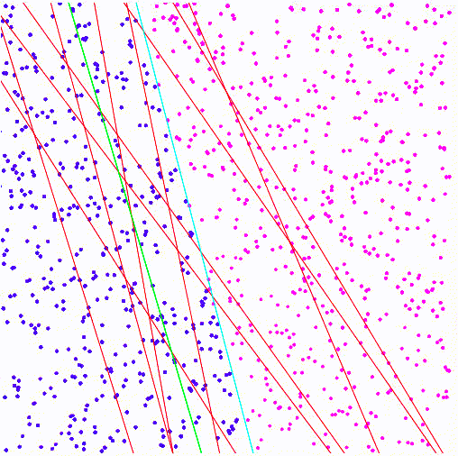

# p5 machine learning demo
A demo of machine learning in p5.js with no external libraries

Finds the line of best fit for separating a bunch of dots. (shown in blue and purple, the separation of these dots is shown by the cyan line)

The current generation's best line is green while all the rest are red.

